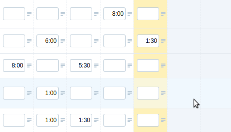

# actitime-add-tt-bookmarklet

[![Tested with TestCafe][testcafe-image]][testcafe-url]

[![Build Status][build-image]][build-url]
[![Dependency Status][depstat-image]][depstat-url]
[![DevDependency Status][depstat-dev-image]][depstat-dev-url]

> actiTIME add Time-Track bookmarklet

## License
MIT © [Vladimir Rodkin](https://github.com/VovanR)

[codestyle-url]: https://github.com/xojs/xo
[codestyle-image]: https://img.shields.io/badge/code_style-XO-5ed9c7.svg?style=flat-square

[testcafe-url]: https://github.com/DevExpress/testcafe
[testcafe-image]: https://img.shields.io/badge/tested%20with-TestCafe-2fa4cf.svg?style=flat-square

[build-url]: https://github.com/VovanR/actitime-add-tt-bookmarklet/actions?query=workflow%3A%22End-to-End+Tests%22
[build-image]: https://img.shields.io/github/workflow/status/VovanR/actitime-add-tt-bookmarklet/End-to-End%20Tests?style=flat-square

[depstat-url]: https://david-dm.org/VovanR/actitime-add-tt-bookmarklet
[depstat-image]: https://david-dm.org/VovanR/actitime-add-tt-bookmarklet.svg?style=flat-square

[depstat-dev-url]: https://david-dm.org/VovanR/actitime-add-tt-bookmarklet
[depstat-dev-image]: https://david-dm.org/VovanR/actitime-add-tt-bookmarklet/dev-status.svg?style=flat-square
